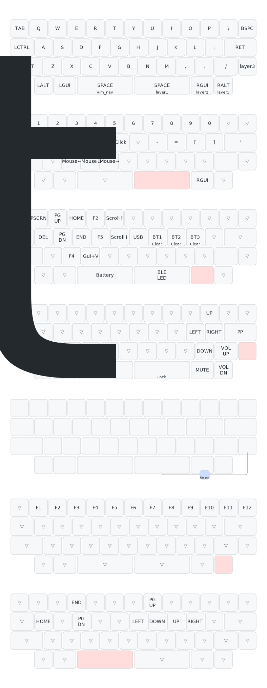

# zmk-config for Agar Mini BLE

ZMK firmware configuration for the Agar Mini BLE 40% keyboard.

## Keymap

## Special Features

- **BT1/BT2/BT3**: Tap to switch, hold 3s to clear pairing
- **Reset**: Tap for system reset, hold 2s for bootloader
- **SoftOff**: Hold 2s to power off (red LED feedback)
- **Lock Layer**: Hold 2s to enter lock mode (yellow LED), combo to exit (green LED)
- **USB Auto-Switch**: Automatically switches to USB when connected (white LED)
- **Wakeup (Soft off)**: S key wakes the board (configured in `config/boards/shields/klink_kbd/common.overlay`)

## Wakeup Notes (Soft off)

- Wakeup source is the S key (row 1, col 2) via `wakeup_scan` in `config/boards/shields/klink_kbd/common.overlay`.
- If wakeup feels unresponsive, hold S for ~0.5-1s or tap A/S/D a few times to create a reliable edge.

## LED Indicators

| Event | Color |
|-------|-------|
| BT1 connected | Yellow |
| BT2 connected | Cyan |
| BT3 connected | Magenta |
| USB connected | White |
| Lock layer enter | Yellow |
| Lock layer exit | Green |
| Soft off | Red |
| Battery (80%+) | Green |
| Battery (50-80%) | Cyan |
| Battery (20-50%) | Yellow |
| Battery (<20%) | Red |

## Build

Firmware is built via GitHub Actions. Push changes and download from Actions artifacts.
